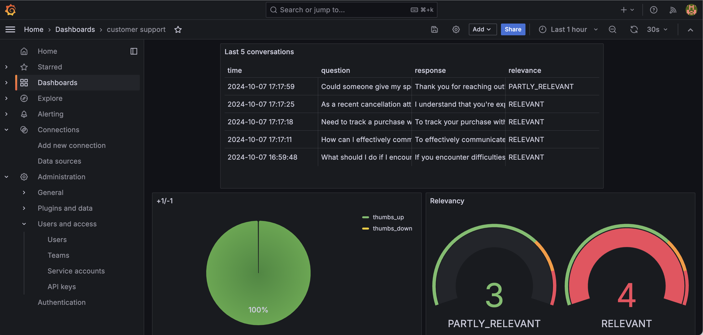

# Customer Support Assistant

Providing timely and effective customer support can be challenging, especially for small businesses with limited resources. Hiring full-time support staff isn't always feasible, and responding to every inquiry promptly can be overwhelming.

**Customer Support Assistant** offers a conversational AI that helps businesses manage customer queries efficiently. It suggests responses, automates common inquiries, and improves customer satisfaction, making support more accessible and scalable.


This project was developed as part of the **LLM Zoomcamp**, a free course focused on Large Language Models (LLMs) and Retrieval-Augmented Generation (RAG).


## Project overview

The **Customer Support Assistant** is a RAG application designed to help businesses streamline their customer support processes.

Main Use Cases:

- **Automated Responses**: Recommending accurate and context-aware responses based on customer queries.
- **Query Resolution**: Providing alternative solutions for common customer issues.
- **Guided Instructions**: Offering step-by-step guidance to resolve specific problems or troubleshoot products.
- **Conversational Interaction**: Allowing users to get instant support without navigating complex documentation or waiting for human assistance.

## Dataset

The dataset used in this project is the [Bitext Customer Support LLM Chatbot Training Dataset](https://huggingface.co/datasets/bitext/Bitext-customer-support-llm-chatbot-training-dataset).

### Fields of the Dataset

Each entry in the dataset contains the following fields:

- **flags**: Tags associated with the entry (explained below in the Language Generation Tags section).
- **instruction**: A user request from the Customer Service domain.
- **category**: The high-level semantic category representing the intent of the user query.
- **intent**: The specific intent corresponding to the user instruction.
- **response**: An example of the expected response from the virtual assistant.

### Categories and Intents

The dataset covers the following categories and corresponding intents:

- **ACCOUNT**: `create_account`, `delete_account`, `edit_account`, `switch_account`
- **CANCELLATION_FEE**: `check_cancellation_fee`
- **DELIVERY**: `delivery_options`
- **FEEDBACK**: `complaint`, `review`
- **INVOICE**: `check_invoice`, `get_invoice`
- **NEWSLETTER**: `newsletter_subscription`
- **ORDER**: `cancel_order`, `change_order`, `place_order`
- **PAYMENT**: `check_payment_methods`, `payment_issue`
- **REFUND**: `check_refund_policy`, `track_refund`
- **SHIPPING_ADDRESS**: `change_shipping_address`, `set_up_shipping_address`

This dataset plays a crucial role in training the Customer Support Assistant to handle a wide range of customer service queries, providing accurate and context-aware responses.

You can find the dataset [here](https://huggingface.co/datasets/bitext/Bitext-customer-support-llm-chatbot-training-dataset).


## Technologies

- **Python 3.12**: Used as the primary programming language.
- **Docker and Docker Compose**: For containerization and managing services.
- **Minsearch**: For full-text search functionality.
- **Flask**: Serves as the API interface (see [Background](#background) for more information on Flask).
- **Grafana**: Used for monitoring system performance.
- **PostgreSQL**: The backend database used for Grafana.
- **OpenAI**: Utilized as the Large Language Model (LLM) for generating responses.


## Preparation

Since we use OpenAI, you need to provide the API key:

1. Install `direnv`. If you use Ubuntu, run `sudo apt install direnv` and then `direnv hook bash >> ~/.bashrc`.
2. Copy `.envrc_template` into `.envrc` and insert your key there.
3. For OpenAI, it's recommended to create a new project and use a separate key.
4. Run `direnv allow` to load the key into your environment.

For dependency management, we use pipenv, so you need to install it:

```bash
pip install pipenv
```

Once installed, you can install the app dependencies:

```bash
pipenv install --dev
```

## Running the application


### Database configuration

Before the application starts for the first time, the database
needs to be initialized.

First, run `postgres`:

```bash
docker-compose up postgres
```

Then run the [`db_prep.py`](customer_assist/db_prep.py) script:

```bash
pipenv shell

cd customer_assist

export POSTGRES_HOST=localhost
python db_prep.py
```

To check the content of the database, use `pgcli` (already
installed with pipenv):

```bash
pipenv run pgcli -h localhost -U your_username -d customer_support -W
```

You can view the schema using the `\d` command:

```sql
\d conversations;
```

And select from this table:

```sql
select * from conversations;
```

### Running with Docker-Compose

The easiest way to run the application is with `docker-compose`:

```bash
docker-compose up
```

### Running locally

If you want to run the application locally,
start only postres and grafana:

```bash
docker-compose up postgres grafana
```

If you previously started all applications with
`docker-compose up`, you need to stop the `app`:

```bash
docker-compose stop app
```

Now run the app on your host machine:

```bash
pipenv shell

cd customer_assist

export POSTGRES_HOST=localhost
python app.py
```

### Time configuration

When inserting logs into the database, ensure the timestamps are
correct. Otherwise, they won't be displayed accurately in Grafana.

When you start the application, you will see the following in
your logs:

```
Database timezone: Etc/UTC
Database current time (UTC): 2024-10-07 17:02:32.027899+00:00
Database current time (Europe/Berlin): 2024-10-07 19:02:32.027899+02:00
Python current time: 2024-10-07 19:02:32.028559+02:00
Inserted time (UTC): 2024-10-07 17:02:32.028559+00:00
Inserted time (Europe/Berlin): 2024-10-07 19:02:32.028559+02:00
Selected time (UTC): 2024-10-07 17:02:32.028559+00:00
Selected time (Europe/Berlin): 2024-10-07 19:02:32.028559+02:00
```

Make sure the time is correct.

You can change the timezone by replacing `TZ` in `.env`.

On some systems, specifically WSL, the clock in Docker may get
out of sync with the host system. You can check that by running:

```bash
docker run ubuntu date
```

If the time doesn't match yours, you need to sync the clock:

```bash
wsl

sudo apt install ntpdate
sudo ntpdate time.windows.com
```

Note that the time is in UTC.

After that, start the application (and the database) again.


## Using the application

When the application is running, we can start using it.

### CLI

We built an interactive CLI application using
[questionary](https://questionary.readthedocs.io/en/stable/).

To start it, run:

```bash
pipenv run python cli.py
```

You can also make it randomly select a question from
[our ground truth dataset](data/ground-truth-data.csv):

```bash
pipenv run python cli.py --random
```

### Using `requests`

When the application is running, you can use
[requests](https://requests.readthedocs.io/en/latest/)
to send questions—use [test.py](test.py) for testing it:

```bash
pipenv run python test.py
```

It will pick a random question from the ground truth dataset
and send it to the app.

### CURL

You can also use `curl` for interacting with the API:

```bash
URL=http://localhost:5000
QUESTION="I need to see where we stand w/my purchase, ID #{{order number}}. How do I track this?"
DATA='{
    "question": "'${QUESTION}'"
}'

curl -X POST \
    -H "Content-Type: application/json" \
    -d "${DATA}" \
    ${URL}/question
```

You will see something like the following in the response:

```json
{
  "answer": "To track your purchase with ID #{{order number}}, please visit our website and navigate to the 'Order Tracking' or 'Track Order' section. If you need further assistance, you can also contact our customer support team at {{Customer Support Phone Number}} or use the Live Chat feature on our website at {{Website URL}}. They will be happy to help you with the most up-to-date information regarding your purchase. If you have any other questions, feel free to ask!",
  "conversation_id": "fb586851-39d2-4d27-9fd0-0ec9a3303d00",
  "question": "I need to see where we stand w/my purchase, ID #{{order number}}. How do I track this?"
}
```

Sending feedback:

```bash
ID="fb586851-39d2-4d27-9fd0-0ec9a3303d00"
URL=http://localhost:5000
FEEDBACK_DATA='{
    "conversation_id": "'${ID}'",
    "feedback": 1
}'

curl -X POST \
    -H "Content-Type: application/json" \
    -d "${FEEDBACK_DATA}" \
    ${URL}/feedback
```

After sending it, you'll receive the acknowledgement:

```json
{
  "message": "Feedback received for conversation fb586851-39d2-4d27-9fd0-0ec9a3303d00: 1"
}
```

## Code

The code for the application is in the [`customer_assist`](customer_assist/) folder:

- [`app.py`](customer_assist/app.py) - the Flask API, the main entrypoint to the application
- [`rag.py`](customer_assist/rag.py) - the main RAG logic for building the retrieving the data and building the prompt
- [`ingest.py`](customer_assist/ingest.py) - loading the data into the knowledge base
- [`minsearch.py`](customer_assist/minsearch.py) - an in-memory search engine
- [`db.py`](customer_assist/db.py) - the logic for logging the requests and responses to postgres
- [`db_prep.py`](customer_assist/db_prep.py) - the script for initializing the database
- [`test_db.py`](customer_assist/test_db.py) - the script to test database connection

We also have some code in the project root directory:

- [`test.py`](test.py) - select a random question for testing
- [`cli.py`](cli.py) - interactive CLI for the APP

### Interface

We use Flask for serving the application as an API.

Refer to the ["Using the Application" section](#using-the-application)
for examples on how to interact with the application.

### Ingestion

The ingestion script is in [`ingest.py`](customer_assist/ingest.py).

Since we use an in-memory database, `minsearch`, as our
knowledge base, we run the ingestion script at the startup
of the application.

It's executed inside [`rag.py`](customer_assist/rag.py)
when we import it.

## Experiments

For experiments, we use Jupyter notebooks.
They are in the [`notebooks`](notebooks/) folder.

To start Jupyter, run:

```bash
cd notebooks
pipenv run jupyter notebook
```

We have the following notebooks:

- [`data_preparation.ipynb`](notebooks/data_preparation.ipynb): to prepare a customer support training dataset by filtering, transforming, and saving the data into a structured format suitable for our RAG flow.
- [`rag-test.ipynb`](notebooks/rag-test.ipynb): The RAG flow and evaluating the system.
- [`ground-truth-data.ipynb`](notebooks/ground-truth-data.ipynb): Generating the ground truth dataset for retrieval evaluation.

### Retrieval evaluation

The basic approach - using `minsearch` without any boosting - gave the following metrics:

- Hit rate: 21%
- MRR: 10%

The improved version (with tuned boosting):

- Hit rate: 28%
- MRR: 12%

The best boosting parameters:

```python
boost = {
       'intent': 2.85,
        'category': 0.12,
        'question': 0.03,
        'response': 0.96
    }
```

### RAG flow evaluation

We used the LLM-as-a-Judge metric to evaluate the quality
of our RAG flow.

For `gpt-4o-mini`, in a sample with 200 records, we had:

- 156 (78%) `RELEVANT`
- 38 (19%) `PARTLY_RELEVANT`
- 6 (3%) `NON_RELEVANT`

## Monitoring

We use Grafana for monitoring the application. 

It's accessible at [localhost:3000](http://localhost:3000):

- Login: "admin"
- Password: "admin"

### Dashboards

<p align="center">
  
</p>

The monitoring dashboard contains several panels:

1. **Last 5 Conversations (Table):** Displays a table showing the five most recent conversations, including details such as the question, response, relevance, and timestamp. This panel helps monitor recent interactions with users.
2. **+1/-1 (Pie Chart):** A pie chart that visualizes the feedback from users, showing the count of positive (thumbs up) and negative (thumbs down) feedback received. This panel helps track user satisfaction.
3. **Relevancy (Gauge):** A gauge chart representing the relevance of the responses provided during conversations. The chart categorizes relevance and indicates thresholds using different colors to highlight varying levels of response quality.
4. **Tokens (Time Series):** Another time series chart that tracks the number of tokens used in conversations over time. This helps to understand the usage patterns and the volume of data processed.
5. **Model Used (Bar Chart):** A bar chart displaying the count of conversations based on the different models used. This panel provides insights into which AI models are most frequently used.

### Setting up Grafana

All Grafana configurations are in the [`grafana`](grafana/) folder:

- [`init.py`](grafana/init.py) - for initializing the datasource and the dashboard.
- [`dashboard.json`](grafana/dashboard.json) - the actual dashboard (taken from LLM Zoomcamp without changes).

To initialize the dashboard, first ensure Grafana is
running (it starts automatically when you do `docker-compose up`).

Then run:

```bash
pipenv shell

cd grafana

env | grep POSTGRES_HOST

python init.py
```

Then go to [localhost:3000](http://localhost:3000):

- Login: "admin"
- Password: "admin"

When prompted, keep "admin" as the new password.
